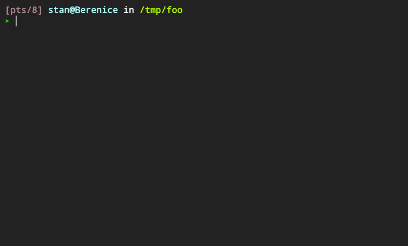

# Changing the Shell's Working Directory with **lf**



Creates a shell function `lfcd` aliased to `lf`. The function launches `lf` and
adds the command *quitcd* which will exit and change the shell's working
directory to `lf`'s final directory before quitting. By default, the exit
command is mapped to *q* which can be changed in *lfrc-shellcd*.

## Installation

```
# Copy files to .config directory
mkdir -p "${XDG_CONFIG_HOME:-$HOME/.config}/lf-shellcd"
cp lfrc-shellcd lf-shellcd "${XDG_CONFIG_HOME:-$HOME/.config}/lf-shellcd"

# Configure your shell
echo 'source "${XDG_CONFIG_HOME:-$HOME/.config}/lf-shellcd/lf-shellcd"' \
    >>~/.config/zsh/.zshrc
#     ^---- replace with path to your zshrc/bashrc
```

If you've installed `lf-ueberzug` and want image previews by default when
running `lf` from your shell with the above setup use `lf-ueberzug` in line
4 of *lf-shellcd* (instead of `lf`):

```
# ...
	lf-ueberzug -last-dir-path "$LF_SHELLCD_TEMPDIR/lastdir" \
# ...
```

To uninstall simply delete the files and remove the added line from your
zshrc/bashrc.
